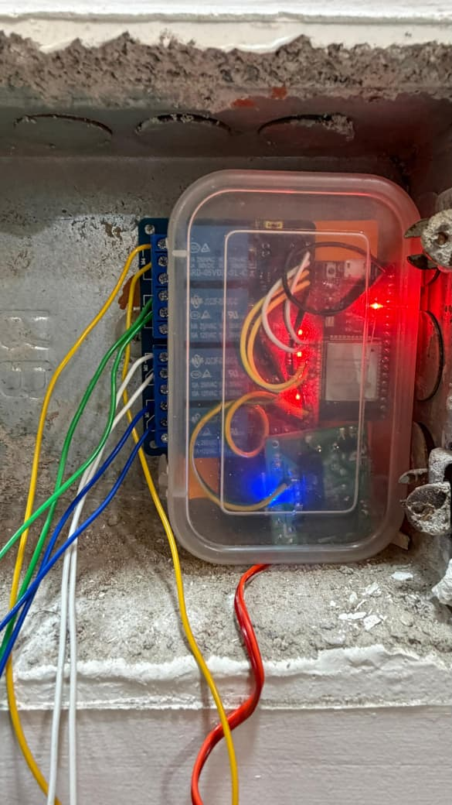
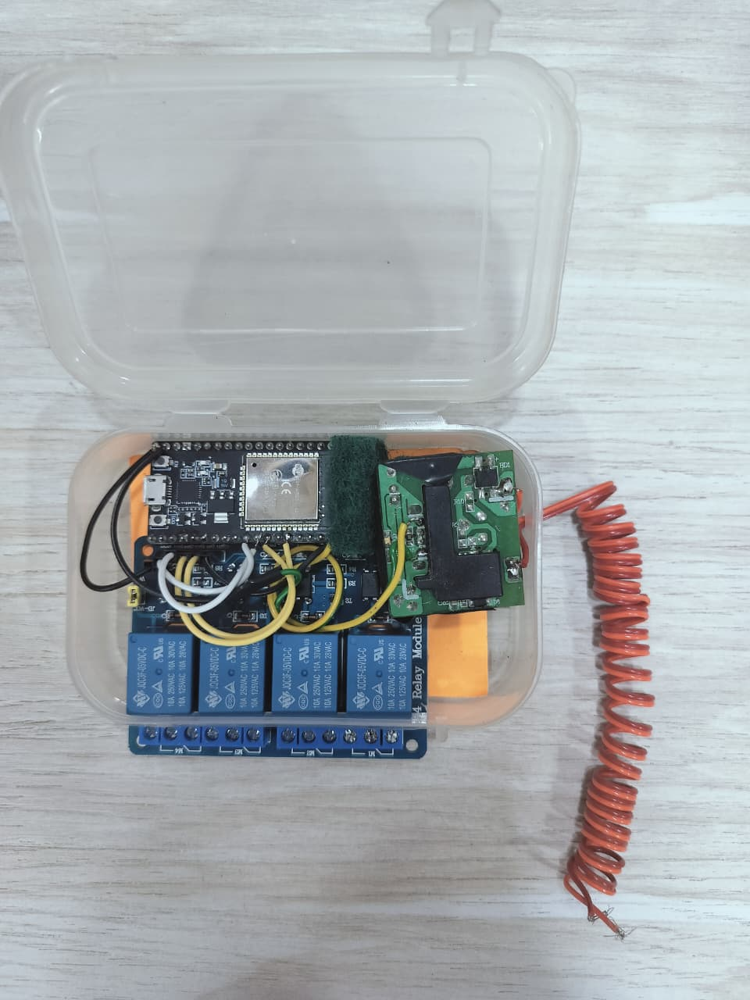
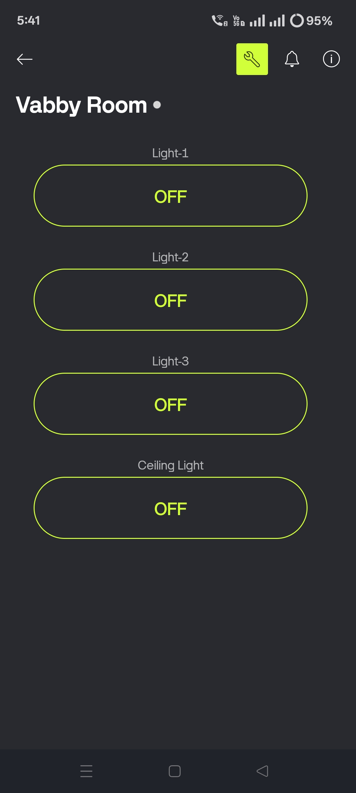

# Smart-home-automation
Smart Home Automation using ESP32 enables remote control of appliances via a mobile app. The ESP32 connects to Wi-Fi and communicates with Blynk to receive commands. A relay module switches devices ON/OFF, providing convenience, energy efficiency, and real-time control.
# 🏠 Smart Home Automation using ESP32

## 📌 Description
This project enables remote control of home appliances using ESP32 and Blynk app.

## ⚙️ Components Used
- ESP32
- Relay Module
- Jumper Wires
- 5V Power Supply

## 🚀 Features
- Remote ON/OFF control
- WiFi connectivity
- Real-time response

## 🔌 Working
User sends command via mobile app → ESP32 receives via WiFi → Relay switches appliance

## 📸 Project Images

## 📸 Application interface

## 🔧 Circuit Diagram
.png)

## 🧠 Future Improvements
- Voice control
- Sensor integration
